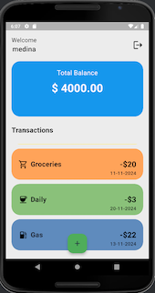
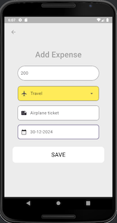
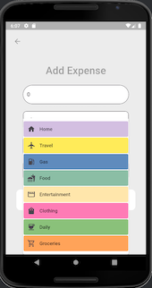

# Expenses App

## Overview

The **Expenses App** is a Flutter application designed to help users manage their personal expenses efficiently. With features like expense tracking, categorization, and user-specific data, the app provides a seamless and intuitive interface for monitoring financial habits.

---

## Features

- **Expense Tracking:**  
  Add and view expenses with details like amount, category, and notes.

- **User Authentication:**  
  Secure login and registration using Firebase email and password authentication.

- **Category Management:**  
  Select expense categories with icons and labels. Default placeholder values are displayed until a category is selected.

- **Real-time Updates:**  
  Newly added expenses appear immediately without refreshing or navigating away.

- **Keyboard Interaction:**  
  Intelligent handling of the keyboard to ensure smooth interaction with dropdown menus and input fields.

- **Error Handling:**  
  Validations for empty fields, password confirmation, and duplicate emails during user registration.

---

## Screenshots
Here are some screenshots of the app in action:
### Login Page


### Register Page


### All Expenses


### Add Expense


### Categories


### Select date


## Installation

1. **Clone the Repository:**
   ```bash
   git clone <repository_url>
   cd expenses_app
